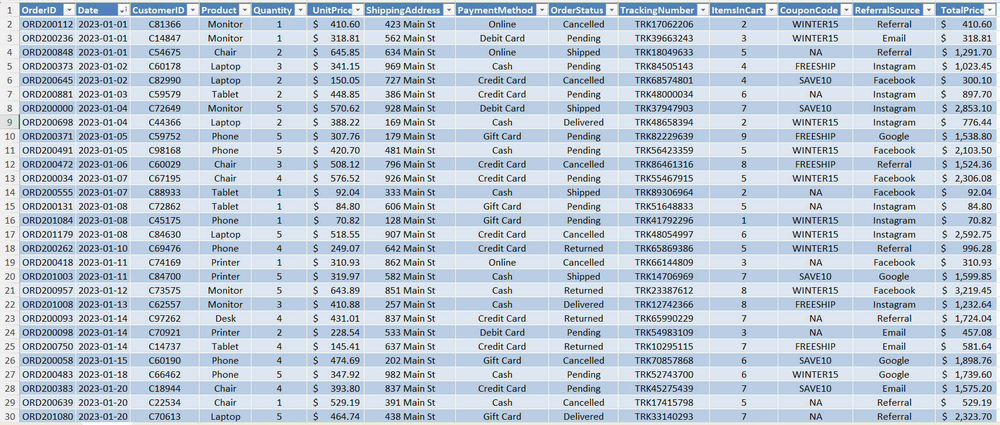

# sales-data-cleaning-project
Cleaned a dirty sales dataset using Excel: Includes raw and cleaned data with full documentation of the cleaning process — Data Analytics internship project at DecodeLabs

## Project Overview
This project involved cleaning a dirty sales dataset as part of my internship at DecodeLabs. The raw data contained inconsistencies, blank fields, and formatting issues that needed to be resolved to ensure data integrity and usability for analysis.

## Folder Structure
```
data/
  raw/       (Original, uncleaned dataset)
  cleaned/   (Final cleaned dataset)
```

## Tools Used
Microsoft Excel — Tables, Find & Replace, TRIM/CLEAN functions, Sort, Number Formatting, Cell Alignment, Currency Formatting

## Related Projects
- [Sales Data EDA](https://github.com/dedejacksona/sales-data-eda-decodelabs) — Exploratory data analysis built on this cleaned dataset
- [SQL Sales Analysis](https://github.com/dedejacksona/sql-sales-analysis-decodelabs) — SQL queries on the same underlying dataset
- [Sales Data Visualization](https://github.com/dedejacksona/sales-data-visualization-decodelabs) — Charts and visual reporting on this dataset

## Cleaning Steps Performed

| ID | Change | Impact | Status |
|---|---|---|---|
| T001 | Converted dataset to a Table | Better presentation and easier cleaning operations | Success |
| B002 | Filled blank CouponCode values with "NA" | Eliminated blanks, improving data integrity | Success |
| TC03 | Trimmed and cleaned OrderID, CustomerID, Product, ShippingAddress, PaymentMethod, OrderStatus, TrackingNumber, CouponCode, ReferralSource | Removed unnecessary spaces and unprintable characters | Success |
| D004 | Formatted UnitPrice and TotalPrice to 2 decimal places | Enabled uniform number presentation | Success |
| A005 | Autofitted rows and columns | Easier to read and understand the data | Success |
| CM06 | Center and middle aligned all records | Made the data more presentable | Success |
| DS07 | Sorted by date, oldest to newest | Organized data chronologically by purchase date | Success |
| CLA8 | Added dollar currency labels | Made currency values realistic and clear | Success |

## Result
A clean, consistent, analysis-ready sales dataset with standardized formatting, no blank critical fields, and improved data integrity.

## Before & After

**Raw Data (Before Cleaning)**


**Cleaned Data (After Cleaning)**

